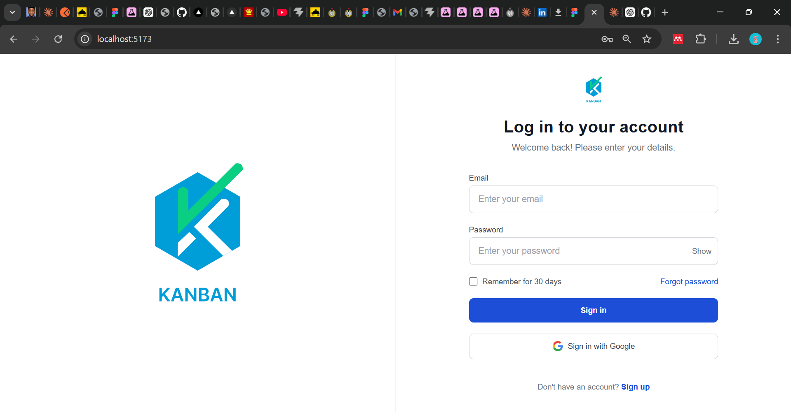
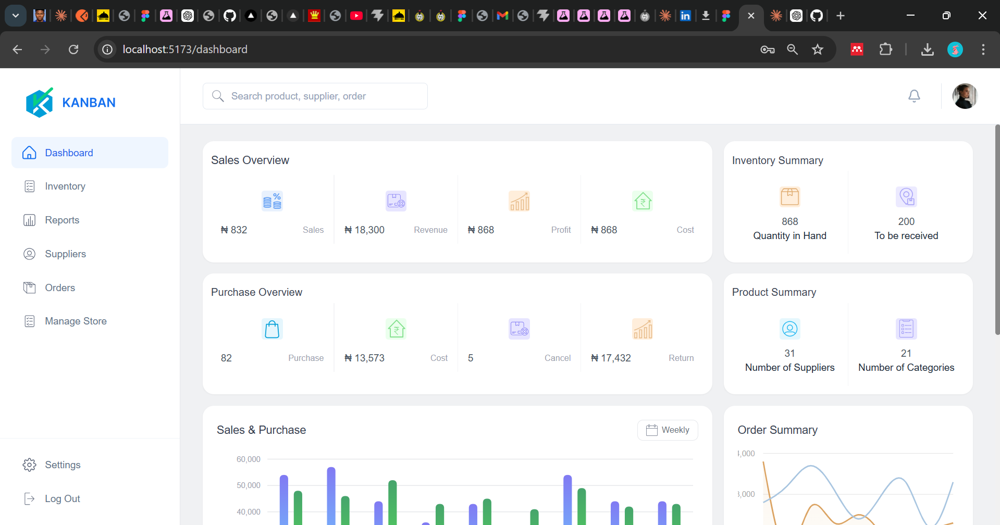
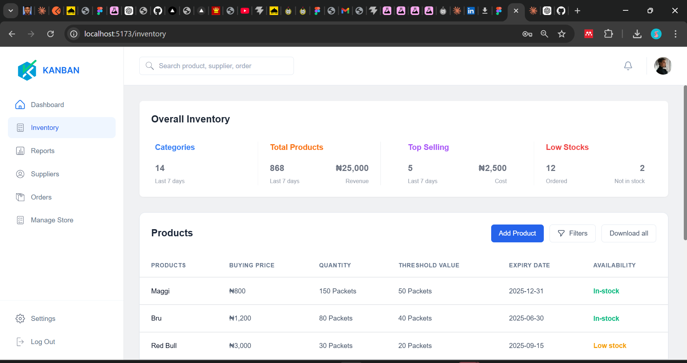

# React + Vite

This template provides a minimal setup to get React working in Vite with HMR and some ESLint rules.

Currently, two official plugins are available:

- [@vitejs/plugin-react](https://github.com/vitejs/vite-plugin-react/blob/main/packages/plugin-react) uses [Oxc](https://oxc.rs)
- [@vitejs/plugin-react-swc](https://github.com/vitejs/vite-plugin-react/blob/main/packages/plugin-react-swc) uses [SWC](https://swc.rs/)

## React Compiler

The React Compiler is not enabled on this template because of its impact on dev & build performances. To add it, see [this documentation](https://react.dev/learn/react-compiler/installation).

## Expanding the ESLint configuration

If you are developing a production application, we recommend using TypeScript with type-aware lint rules enabled. Check out the [TS template](https://github.com/vitejs/vite/tree/main/packages/create-vite/template-react-ts) for information on how to integrate TypeScript and [`typescript-eslint`](https://typescript-eslint.io) in your project.
   

   # ChowTap Frontend Engineering Challenge   you can also check out the live link here "https://chowtap-challenge.vercel.app/"

> Building a logistics with a pixel-perfect, web application.


## 📋 Table of Contents

- [Overview](#overview)
- [Features](#features)
- [Tech Stack](#tech-stack)
- [Project Structure](#project-structure)
- [Installation & Setup](#installation--setup)
- [Running the Application](#running-the-application)
- [Testing Credentials](#testing-credentials)
- [Key Features](#key-features)
- [Design Specifications](#design-specifications)
- [State Management](#state-management)
- [Screenshots](#screenshots)
- [Why ChowTap](#why-chowtap)
- [Submission Details](#submission-details)


## 🎯 Overview

ChowTap Frontend Engineering Challenge is a fully functional, pixel-perfect implementation of a campus food logistics management system. Built with modern React practices, this application demonstrates:

✅ **Pixel-Perfect Design** - Exact Figma to Code implementation  
✅ **Production-Ready Code** - Clean, modular, and scalable architecture  
✅ **State Management** - Redux Toolkit for global state  
✅ **Data Visualization** - Recharts for professional charts  
✅ **Form Validation** - Comprehensive error handling  
✅ **User Feedback** - React Hot Toast notifications  
✅ **Protected Routes** - Authentication-based navigation  

---

## ✨ Features

### 1. **Authentication Page**
- Email & password validation with real-time error feedback
- Custom form handling with useForm hook
- Loading states during authentication
- Success/error toast notifications
- Secure logout functionality

### 2. **Dashboard**
- Sales Overview KPI cards with dynamic metrics
- Purchase Overview with detailed breakdowns
- Inventory Summary cards
- Product Summary statistics
- Sales & Purchase Bar Chart (Recharts with custom gradients)
- Order Summary Dual-Line Chart (smooth curves, filled areas)
- Top Selling Stock table with sorting
- Low Quantity Stock alerts
- Responsive grid layout

### 3. **Inventory Management**
- Overall Inventory KPI metrics with typography precision
- Products table with 10 items per page
- Stock status color-coding (In-stock, Out of stock, Low stock)
- Pagination controls (Previous/Next)
- Add Product button (ready for feature expansion)
- Download all products functionality
- Filter options for advanced queries
- Hover effects and smooth transitions

### 4. **Navigation & Sidebar**
- Fixed sidebar with persistent navigation
- Active route highlighting
- Settings menu
- Logout with confirmation
- Search bar with placeholder
- User profile avatar with initials
- Notification bell icon

## 🛠 Tech Stack

### Frontend Framework
- **React 18.2.0** - Latest UI library for building interactive components
- **Vite 5.0.8** - Lightning-fast build tool and dev server
- **React Router DOM 6.20.0** - Client-side routing with protected routes

### State Management
- **Redux Toolkit 1.9.7** - Predictable state management with minimal boilerplate
- **React Redux 8.1.3** - Official React bindings for Redux

### Styling
- **Tailwind CSS 3.3.6** - Utility-first CSS framework for rapid UI development
- **PostCSS 8.4.32** - CSS transformation for Tailwind compilation
- **Autoprefixer 10.4.16** - Vendor prefix automation

### Data Visualization
- **Recharts 2.10.3** - Composable charting library built on React components
  - Bar Charts with custom gradients
  - Dual-line charts with smooth curves
  - Responsive container handling

### User Feedback
- **React Hot Toast 2.4.1** - Lightweight toast notification system
  - Success, error, and custom notifications
  - Configurable positioning and duration
  - Auto-dismiss functionality

### HTTP Client
- **Axios 1.6.2** - Promise-based HTTP client (ready for API integration)

### Development Tools
- **ESLint** - Code quality and consistency
- **@vitejs/plugin-react** - Vite React plugin with Fast Refresh

---

## 📁 Project Structure

```
chowtap-frontend/
├── src/
│   ├── components/
│   │   ├── Sidebar.jsx                    # Navigation sidebar
│   │   ├── TopBar.jsx                     # Top navigation bar
│   │   ├── ProtectedLayout.jsx            # Layout wrapper for protected routes
│   │   ├── SalesPurchaseChart.jsx         # Bar chart component
│   │   ├── OrderSummaryChart.jsx          # Dual-line chart component
│   │   ├── TopSellingStock.jsx            # Top products table
│   │   ├── LowStockProducts.jsx           # Low stock alerts
│   │   └── KPICardsSection.jsx            # Overall inventory metrics
│   ├── pages/
│   │   ├── Login.jsx                      # Authentication page
│   │   ├── Dashboard.jsx                  # Main dashboard
│   │   └── Inventory.jsx                  # Inventory management
│   ├── store/
│   │   ├── index.js                       # Redux store configuration
│   │   └── slices/
│   │       ├── authSlice.js               # Authentication state
│   │       ├── dashboardSlice.js          # Dashboard data state
│   │       └── inventorySlice.js          # Inventory data state
│   ├── utils/
│   │   └── validation.js                  # Form validation utilities
│   ├── hooks/
│   │   └── useForm.js                     # Custom form handling hook
│   ├── styles/
│   │   └── index.css                      # Global styles and Tailwind
│   ├── App.jsx                            # Main app with routing
│   └── main.jsx                           # React entry point
├── index.html                             # HTML entry point
├── vite.config.js                         # Vite configuration
├── tailwind.config.js                     # Tailwind CSS configuration
├── postcss.config.js                      # PostCSS configuration
├── package.json                           # Project dependencies
├── .gitignore                             # Git ignore rules
└── README.md                              # This file
```

---

## 🚀 Installation & Setup

### Prerequisites
- **Node.js** 16.0 or higher
- **npm** 7.0 or higher (or **yarn** 1.22+)

### Step 1: Clone the Repository
```bash
git clone https://github.com/miecrose12/chowtap-challenge.git
cd chowtap-frontend
```

### Step 2: Install Dependencies
```bash
npm install
# or
yarn install
```

### Step 3: Environment Setup (Optional)
Create a `.env.local` file in the root directory:
```env
VITE_API_BASE_URL=http://localhost:3000
VITE_APP_NAME=ChowTap
```

### Step 4: Start Development Server
```bash
npm run dev
# or
yarn dev
```

The application will open at `http://localhost:5173` with Vite's Fast Refresh enabled.

### Step 5: Build for Production
```bash
npm run dev
# or
yarn build
```

Preview the production build:
```bash
npm run preview


---

## 🔑 Testing Credentials


## 🎨 Design Specifications

### Color Palette
- **Primary Blue** (#0e69d5, #0ea5e9) - CTA buttons, active states
- **Secondary Blue** (#3b82f6) - Charts, secondary elements
- **Success Green** (#10b981, #46A46C) - Positive indicators
- **Warning Amber** (#f59e0b, #f4a91f) - Caution states
- **Error Red** (#ef4444, #dc2626) - Negative indicators
- **Neutral Grays** (#5D6679, #94a3b8) - Typography, borders

### Typography
- **Font Family:** Inter (400, 500, 600, 700 weights)
- **Base Font Size:** 14px
- **KPI Text:** 16px Semi-Bold (#5D6679)
- **Headings:** 20px-28px Bold
- **Labels:** 12px Regular

### Spacing System
- **Base Unit:** 4px
- **Components:** 6px-24px padding
- **Sections:** 8px (32px) gap
- **Grid:** 6-column layout with responsive adjustments

### Border & Shadows
- **Card Border:** 1px solid #e2e8f0
- **Card Shadow:** 0 1px 3px rgba(0,0,0,0.05)
- **Input Border:** 1px solid #d1d5db
- **Border Radius:** 8px cards, 6px inputs/buttons

### Chart Specifications

#### Sales & Purchase Bar Chart
- **Bar Width:** 10px
- **Gradient (Purchase):** #817AF3 → #74B0FA → #79D0F1
- **Gradient (Sales):** #46A46C → #51CC5D → #57DA65
- **Border Radius:** 40px bottom corners
- **Grid Lines:** #D0D3D9 (horizontal only)
- **Y-Axis Range:** 10,000-60,000 with 6 ticks

#### Order Summary Line Chart
- **Line Type:** Monotone (smooth curves)
- **Ordered Line:** #C4884A with 0.15 opacity fill
- **Delivered Line:** #A8C5E0 with 0.15 opacity fill
- **Dot Size:** 5px (active: 7px)
- **Stroke Width:** 2.5px

---

## 🔄 State Management

### Redux Store Architecture

#### Auth Slice
```javascript
// State
{
  isAuthenticated: boolean,
  user: string | null,
  email: string | null,
  loading: boolean,
  error: string | null
}

// Actions
loginStart() → set loading: true
loginSuccess(payload) → set authenticated, user data
loginFailure(error) → set error message
logout() → clear all auth state
```

#### Dashboard Slice
```javascript
// State
{
  salesData: Array,
  orderData: Array,
  topSellingProducts: Array,
  lowStockProducts: Array,
  salesOverview: Object,
  inventorySummary: Object,
  purchaseOverview: Object,
  productSummary: Object,
  loading: boolean,
  error: string | null
}

// Mock Data (ready for API integration)
```

#### Inventory Slice
```javascript
// State
{
  products: Array,
  overallInventory: Object,
  currentPage: number,
  itemsPerPage: number,
  loading: boolean,
  error: string | null
}

// Actions
setCurrentPage(page) → pagination
setInventoryLoading(bool)
setInventoryError(error)
addProduct(product) → new product
```

---

## 🎯 Key Implementation Details

### Form Validation
- Email format validation (RFC 5322)
- Password minimum length (6 characters)
- Real-time error display on blur
- Form-level error messages
- Custom validation hooks

### Protected Routes
- Authentication check before route access
- Automatic redirect to login if unauthenticated
- User session persistence with Redux

### Charts with Recharts
- Responsive containers with automatic scaling
- Custom tooltips and legends
- Gradient fills for visual appeal
- Smooth animations on load
- Mobile-responsive sizing

### Notifications
- Success toasts on login/logout
- Error toasts on validation failure
- Info toasts for user actions
- Auto-dismiss with configurable duration

---

## 📸 Screenshots

### Login Page

- Clean, centered form layout
- Email and password inputs with validation
- Remember me checkbox
- Google Sign-in button
- Left hero section with branding (desktop only)

### Dashboard

- Sales Overview KPIs (4 cards)
- Inventory Summary (2 cards)
- Purchase Overview (4 cards)
- Sales & Purchase Bar Chart with gradients
- Order Summary Dual-Line Chart
- Top Selling Stock table
- Low Quantity Stock alerts

### Inventory

- Overall Inventory KPI metrics
- Products table with 9 rows visible
- Pagination controls
- Action buttons (Add, Filter, Download)
- Status badges with color coding
- Responsive table layout

---


 📋 Code Quality Standards

This project adheres to professional frontend development practices:

### DRY (Don't Repeat Yourself)
- Reusable components for charts, cards, and layouts
- Custom hooks for common functionality
- Centralized validation logic
- Redux slices for state patterns

### KISS (Keep It Simple, Stupid)
- Clear file naming and organization
- Single responsibility components
- Minimal external dependencies
- Straightforward state flow

### Code Organization
```
Feature-based structure:
- Components for reusable UI
- Pages for route components
- Store for Redux logic
- Utils for helper functions
- Hooks for component logic
```

### Best Practices
- Functional components with hooks
- Proper prop typing (ready for TypeScript)
- Error boundaries (ready for implementation)
- Accessibility considerations (semantic HTML, ARIA labels)
- Performance optimization (memoization-ready)

---

## 🔒 Security Considerations

- Password validation (client-side, server-side in production)
- Protected routes with authentication checks
- Redux persist ready for secure token storage
- No sensitive data in localStorage (currently)
- CSRF protection ready for API calls


## 🤝 Support

For questions or issues:
1. Review the README thoroughly
2. Check the project structure for file locations
3. Verify Node.js and npm versions
4. Clear node_modules and reinstall if issues persist


Built with by ITOBIYE EROMHOMHELE BLOSSOM**  
*Making campus food logistics smarter, one pixel at a time.*